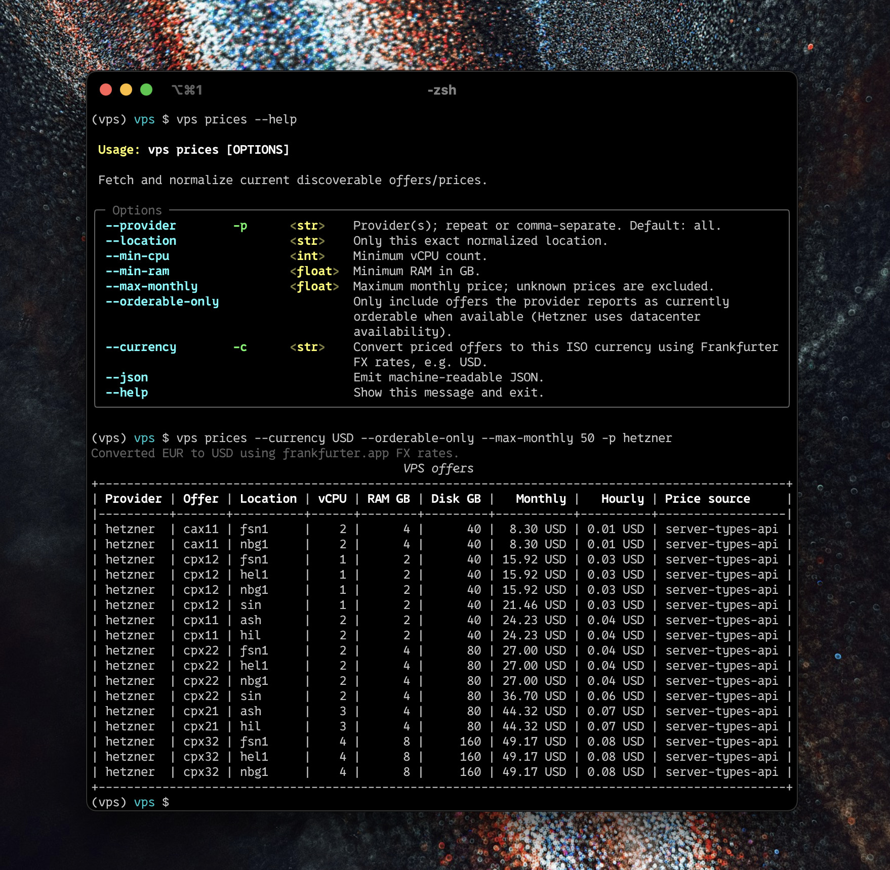

# `vps`



A small Python module and CLI that normalizes VPS discovery and provisioning across:

- **Hetzner Cloud**
- **OVHcloud VPS**
- **Contabo VPS/VDS**

It exposes a common `Offer`, `Quote`, `Server`, and `CreateServerRequest` model and prints human-readable **ASCII tables** with Rich. JSON output is available for automation.

> **Important:** `create` / `order` can incur real charges. The CLI refuses billable operations unless `--yes` is supplied. If the provider API cannot establish a price, it additionally requires `--allow-unknown-price`.

## Install

This project is managed with [uv](https://docs.astral.sh/uv/). From the repository root, create and activate a uv virtual environment, then install the package into it:

```bash
uv venv
source .venv/bin/activate
uv sync --active --no-dev
```

Verify the CLI is installed:

```bash
vps --help
```

Verify the Python module is importable from the same virtual environment:

```bash
python -c "import vps; print(vps.Offer)"
```

Development/tests:

```bash
uv venv
source .venv/bin/activate
uv sync --active --group dev
pytest
```

Build distributions:

```bash
uv build
```

## Credentials

Copy `.env.example` to `.env` and fill in the credentials you want to use. The `vps` package loads `.env` automatically with `python-dotenv` from the current directory or its parents. Existing shell environment variables take precedence.

```bash
cp .env.example .env
# edit .env
vps prices
```

### Hetzner

```dotenv
HETZNER_TOKEN=...
```

### OVHcloud

```dotenv
OVH_ENDPOINT=ovh-eu
OVH_SUBSIDIARY=GB
OVH_APPLICATION_KEY=...
OVH_APPLICATION_SECRET=...
OVH_CONSUMER_KEY=...
```

The OVH token needs rights for the order/cart endpoints and VPS reads you intend to use.

### Contabo

```dotenv
CONTABO_CLIENT_ID=...
CONTABO_CLIENT_SECRET=...
CONTABO_API_USER=...
CONTABO_API_PASSWORD=...
```

## CLI

The examples below assume you installed `vps` into a uv virtual environment and activated it with `source .venv/bin/activate`. Credentials are read automatically from `.env` when present.

### Compare offers/prices

```bash
vps prices
vps prices -p hetzner
vps prices -p hetzner --orderable-only
vps prices -p ovhcloud
vps prices -p hetzner -p ovhcloud --currency USD --min-ram 8 --max-monthly 20
vps prices --currency EUR --json
```

Money values in CLI tables are displayed with two decimal places.

Example columns:

```text
+----------+----------+----------+------+--------+---------+-------------+-------------+--------------------+
| Provider | Offer    | Location | vCPU | RAM GB | Disk GB | Monthly     | Hourly      | Price source       |
+----------+----------+----------+------+--------+---------+-------------+-------------+--------------------+
| hetzner  | cx23     | nbg1     | 2    | 4      | 40      | ... USD     | ... USD     | server-types-api   |
| ovhcloud | ...      | GRA      | 4    | 16     | 160     | ... USD     | ... USD     | public-vps-catalog |
| contabo  | V153     | -        | ?    | ?      | 100     | ?           | ?           | price-unavailable...|
+----------+----------+----------+------+--------+---------+-------------+-------------+--------------------+
```

### List existing servers

```bash
vps servers
vps servers -p hetzner --json
```

### Quote / dry-run

```bash
vps quote hetzner cx23 \
  --name worker-01 \
  --location nbg1 \
  --image ubuntu-24.04
```

OVHcloud uses its cart checkout GET as a provider-native dry-run. If OVH reports required configuration labels that the adapter cannot infer, pass them explicitly:

```bash
vps quote ovhcloud PLAN_CODE \
  --name worker-01 \
  --location GRA \
  --image 'Ubuntu 24.04' \
  --ovh-config SOME_REQUIRED_LABEL=value
```

### Create/order

Hetzner:

```bash
vps create hetzner cx23 \
  --name worker-01 \
  --location nbg1 \
  --image ubuntu-24.04 \
  --ssh-key my-key \
  --user-data-file examples/cloud-init.yaml \
  --max-monthly 10 \
  --yes
```

`order` is an alias of `create`:

```bash
vps order hetzner cx23 --name worker-02 --location nbg1 --image ubuntu-24.04 --yes
```

Contabo (SSH keys are Contabo numeric Secret IDs):

```bash
vps create contabo V153 \
  --name worker-01 \
  --location EU \
  --ssh-key 12345 \
  --user-data-file examples/cloud-init.yaml \
  --allow-unknown-price \
  --yes
```

OVHcloud:

```bash
vps create ovhcloud PLAN_CODE \
  --name worker-01 \
  --location GRA \
  --image 'Ubuntu 24.04' \
  --max-monthly 15 \
  --yes
```

## Python API

Use the module from the same activated uv virtual environment. Importing `vps` also loads `.env` automatically, without overriding already-exported environment variables:

```bash
source .venv/bin/activate
python your_script.py
```

```python
from vps.models import CreateServerRequest
from vps.providers import HetznerProvider

provider = HetznerProvider()

offers = provider.list_offers()
for offer in offers:
    print(offer.id, offer.location, offer.monthly_price, offer.currency)

request = CreateServerRequest(
    name="worker-01",
    offer_id="cx23",
    location="nbg1",
    image="ubuntu-24.04",
    ssh_keys=["my-key"],
    user_data="#cloud-config\npackage_update: true\n",
)

quote = provider.quote(request)
print(quote)

# Billable:
# server = provider.create_server(request)
```

## Provider behavior and limitations

### Hetzner Cloud

The adapter reads `/server_types` and `/pricing`. Server-type pricing can vary by location; the normalized representation therefore produces one `Offer` per server type/location price combination. When `orderable_only=True` or `vps prices --orderable-only` is used, it also reads `/datacenters` and keeps only server type/location pairs listed in `server_types.available` for at least one datacenter in that location. Server creation uses `POST /servers`.

### OVHcloud

OVHcloud is normalized around its order/cart model:

1. fetch the public VPS catalogue,
2. create + assign a cart,
3. add a VPS plan,
4. add required item configuration,
5. `GET /order/cart/{cartId}/checkout` for validation/dry-run,
6. `POST /order/cart/{cartId}/checkout` to create the order.

OVH catalogue generations are not uniform about exposing structured CPU/RAM/disk fields, so the adapter treats those specs as optional and uses a conservative regex parser over plan codes/names containing three hyphen-separated numbers, such as `vps-value-1-2-40-vps-2025-model1-degressivity24-10percent` (`cores-ram_gb-disk_gb`). OVH fixed-point prices are normalized to major currency units and, when catalogue tax is exposed, gross monthly amounts to match Hetzner's normalized price style. When a provider only exposes a monthly price, vps derives hourly price as `monthly / 730`. When `vps prices --currency TARGET` is used, prices from all providers are converted with Frankfurter public FX rates and original values are preserved in offer metadata. When the catalogue exposes `vps_datacenter` configuration values, the adapter emits one normalized offer per location. Use the plan code as the stable normalized offer ID.

### Contabo

Contabo's Compute API documents product IDs that can be submitted to `POST /v1/compute/instances`, but its public API does **not** expose a general live new-order price catalogue equivalent to Hetzner's `/pricing`. Therefore the default Contabo offers have `monthly_price=None`.

Two optional enrichment modes exist:

1. `CONTABO_PRICE_REFERENCE_INSTANCE_ID`: call the existing-instance upgrade-options endpoint and expose its `vsPrice` values with `price_source=upgrade-reference-api`. These prices/options are **not guaranteed to equal new-order pricing**, and the current product is excluded by that endpoint.
2. `CONTABO_PRICE_CATALOG_JSON`: point to your own normalized JSON catalogue. Those prices are marked `user-catalog-json` and are explicitly not claimed to be provider-verified.

Example JSON:

```json
[
  {
    "id": "V153",
    "name": "Cloud VPS 4",
    "location": "EU",
    "vcpu": 4,
    "ram_gb": 8,
    "disk_gb": 100,
    "monthly_price": "8.50",
    "currency": "EUR"
  }
]
```

## Provider-specific escape hatch

For API fields not normalized yet, `CreateServerRequest.metadata` is intentionally available. From the CLI:

```bash
vps create hetzner cx23 --name demo --metadata-json '{"labels":{"role":"worker"}}' --yes
```

Known metadata keys include:

- Hetzner: `labels`, `public_net`
- OVHcloud: `duration`, `pricing_mode`, `ovh_config`, `auto_pay`, `waive_retractation`
- Contabo: `period`, `default_user`, `root_password_secret_id`, `add_ons`

## API references used for this implementation

- Hetzner Cloud API: https://docs.hetzner.cloud/reference/cloud
- OVHcloud API console: https://api.eu.ovhcloud.com/console/?branch=v1&section=/order
- OVH order-cart configuration guide: https://github.com/ovh/order-cart-examples/blob/master/docs/configuration.en.md
- Contabo API: https://api.contabo.com/
- Frankfurter FX API: https://www.frankfurter.app/
